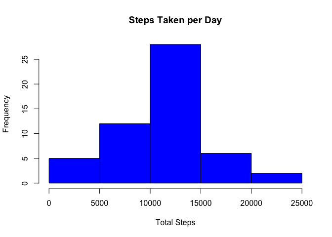
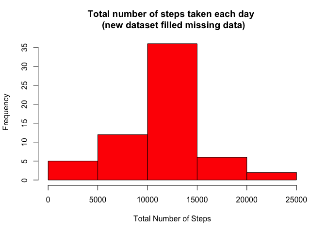

# Reproducible Research: Peer Assessment 1


## Loading and preprocessing the data

After downloading the data set we're uncompressing the zip file and reading the
csv source "activity.csv" into R.


```r
unzip("activity.zip")
data <- read.csv("activity.csv", header=TRUE, sep=",", na.strings="NA")
```

## What is mean total number of steps taken per day?

I am removing NA data before drawing an histogran with frequencies of 
individual's number of steps per day.


```r
clean <- na.omit(data) 
days <- unique(clean$date)
daily <- c()
for (i in 1:length(days)) {
        daily <- append(daily,sum(subset(clean, clean$date == days[i])$steps))
}
# disable scientific notation
options(scipen = 999)

# calculate mean and median
d_mean <- mean(daily)
median <- median(daily)

# plot graph
hist(daily, main="Steps Taken per Day", xlab="Total Steps", col="blue")
```

 

* The mean of total steps taken per day is 10766.189
* The median of total steps taken per day is 10765

## What is the average daily activity pattern?


```r
avg <- aggregate(steps~interval, clean, mean)
plot(avg$interval, avg$steps, type="l", xlab="5-minute interval", ylab="Steps", 
     main="Average number of steps taken across all days")
```

 


On average across all the days in the dataset, the maximum number of steps is __206.17__ is in 5-minute interval __#835__ 

## Imputing missing values

Imported data set has __2304__ missing values.
I am filling those missing values with the mean for that day


```r
# get index of missing values
na <- which(is.na(data$steps))
# get interval of missing values
naInterval = data[na, 3]
dataFiller <- sapply(naInterval, function(x) { avg[(avg$interval==x), 2]})
dataFilled <- data
# Fill missing values
dataFilled[na, 'steps'] <- dataFiller

sumFilled = aggregate(steps~date, dataFilled, sum)
#plot graph
hist(sumFilled$steps, col="red", main="Total number of steps taken each day \n (new dataset filled missing data)", xlab="Total Number of Steps")
```

 


* The __mean__ total number of steps taken per day is __10766.189__
* The __median__ total number of steps taken per day is __10766__

The mean number of steps taken per day are the same (10766.189) because I
filled missing data with the mean.
The median number of steps taken per day are slightly higher (10765 before 
and 10766 after filling missing data). That probably because I
used mean to fill missed data.

## Are there differences in activity patterns between weekdays and weekends?

```r
# create a new factor variable "dateIs" with two levels "Weekday" and "weekend"

dataFilled['day'] <- factor(sapply(dataFilled$date, function(x){ 
        if (weekdays(as.Date(x)) %in% c("Saturday", "Sunday") ) { "weekend" }
        else {"weekday"}
        }))

#calculate the average of steps w.r.t. the time interval and dateIs
avgDayType <- aggregate(steps~interval + day, mean, data=dataFilled)

library(lattice)
xyplot( steps ~ interval | day, data = avgDayType, type="l", layout=c(1,2), xlab="Interval", ylab="Number of steps")
```

 
